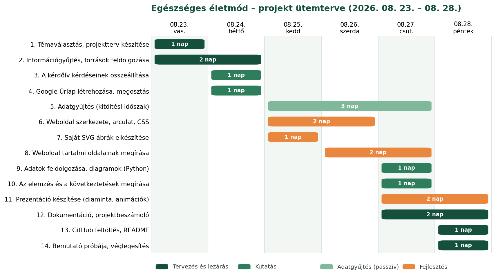

# Projektterv

**IKT Projektmunka I. – osztályozó vizsga házi dolgozat**
1/13. Sz. évfolyam · 2026.

---

## 1. A projekt címe

**Egészséges életmód – „Nem kell tökéletesnek lenni. Csak el kell kezdeni."**

Digitális projekt a 14–19 éves korosztály életmódbeli szokásairól, saját kérdőíves
felmérés alapján.

---

## 2. A projekt célja

A projektnek három, egymásra épülő célja van:

1. **Feltárni**, hogy a környezetemben élő fiatalok milyen életmódbeli szokásokkal
   rendelkeznek — mennyit alszanak, mozognak, mit esznek, mennyi időt töltenek
   képernyő előtt. Ehhez saját kérdőíves adatgyűjtést végzek, nem másodközlő
   internetes cikkekre támaszkodom.

2. **Azonosítani** azokat a területeket, ahol a legnagyobb az elmaradás az ajánlásoktól.
   Az volt a kiinduló feltételezésem, hogy a fiatalok általánosan rosszul élnek — a
   felmérés éppen ezt a feltételezést kellett, hogy ellenőrizze.

3. **Segíteni** egy olyan digitális produktummal, amely az adatokra épül: nem
   általánosságokat mond, hanem konkrét, kicsi, ténylegesen elkezdhető lépéseket
   javasol.

### Kutatási kérdés

> Mennyire élnek egészségesen a 14–19 éves fiatalok a környezetemben, és melyek azok
> a területek, ahol a leginkább elmaradnak az ajánlásoktól?

*Megjegyzés a projekt lezárásakor:* eredetileg egy élesebb kérdést terveztem — hogy a
tudás hiánya vagy valami más akadályozza-e a fiatalokat. Az ehhez szükséges kérdés az
űrlap véglegesítésekor kimaradt, ezért a kutatási kérdést a ténylegesen mért
szokásokra szűkítettem. Részletesen lásd a projektbeszámoló 1. és 5.4 pontját.

---

## 3. A célközönség

| Célcsoport | Miért ők? | Mit kapnak a projekttől? |
|---|---|---|
| **Elsődleges: 14–19 éves középiskolások** | Ebben az életkorban alakulnak ki azok a szokások, amelyek évtizedekre meghatározzák az egészséget. | Konkrét, olcsó és időigény nélküli első lépéseket, saját korosztályi adatokkal alátámasztva. |
| Másodlagos: pedagógusok, osztályfőnökök | Osztályfőnöki óra vagy egészségnap anyagához használható. | Egy saját felmérésre épülő, forrásolt bemutatóanyagot. |
| Másodlagos: szülők | Gyakran nincs képük arról, mennyi képernyőidőt és alvást jelent egy átlagos iskolai hét. | Adatokat és beszélgetési kiindulópontokat. |

A weboldal nyelvezete és a prezentáció hangvétele az elsődleges célcsoporthoz igazodik:
tegeződő, közvetlen, de nem lekezelő, és nem moralizál.

---

## 4. A feladatok listája

### 4.1 Tervezés
- [x] Témaválasztás és a kutatási kérdés megfogalmazása
- [x] Projektterv elkészítése (ez a dokumentum)
- [x] Ütemterv összeállítása

### 4.2 Információgyűjtés
- [x] Legalább 5 megbízható forrás felkutatása és feldolgozása
- [x] Forrásjegyzék elkészítése pontos hivatkozásokkal
- [x] Képek és ábrák forrásainak tisztázása

### 4.3 Kutatás (választott feladat: **D) Online kérdőív és elemzés**)
- [x] Kérdések összeállítása öt témakörben (a végleges űrlapon 16 kérdés)
- [x] Google Űrlap létrehozása és megosztása
- [x] Legalább 20 kitöltő elérése (22 fő)
- [x] Adatfeldolgozó szkript megírása (Python – pandas, matplotlib)
- [x] 18 diagram elkészítése
- [x] Írásos elemzés és következtetések

### 4.4 Digitális produktum (kötelező elem)
- [x] Projektweboldal szerkezetének megtervezése (6 aloldal)
- [x] Egyedi arculat és stíluslap Bootstrap 5.3 fölé
- [x] Saját SVG illusztrációk készítése (5 db)
- [x] Tartalmi oldalak megírása
- [x] Interaktív elem (napi ellenőrzőlista, JavaScript)
- [x] Reszponzivitás és billentyűzetes használhatóság ellenőrzése

### 4.5 Prezentáció (választott feladat: **A) Prezentáció**)
- [x] Saját diaminta készítése (világos és sötét változat)
- [x] 16 dia megtervezése és megírása
- [x] Natív diagramok beillesztése
- [x] Áttűnések és belépő animációk beállítása
- [x] Előadói jegyzetek minden diához

### 4.6 Dokumentáció és lezárás
- [x] Projektbeszámoló megírása
- [x] GitHub repository létrehozása a megadott mappaszerkezettel
- [x] README.md elkészítése
- [ ] A bemutató próbája (5–10 perc)

---

## 5. Feladatmegosztás

### Csoporttagok

| Név | Szerep | Feladatkör |
|---|---|---|
| **Gerecze Ádám** | projektvezető, kutató, fejlesztő, dokumentáló | a projekt teljes tartalma |

### Az önálló munka indoklása

A feladatkiírás 2–3 fős csoportokat ír elő, és a csoportmunkát javasolja. A
csoportbeosztás során azonban nem alakult ki több fős csapat, ezért a projekt minden
elemét egyedül készítettem el.

**Ennek a hátrányai, amelyekkel számoltam:**
- Nem volt kivel megvitatni a szakmai döntéseket, így nagyobb a kockázata annak, hogy
  egy hibás irányt sokáig viszek tovább.
- A kérdőívet egyetlen ismeretségi körben tudtam terjeszteni, ami növeli a minta
  torzítását. Ezt a korlátot a dokumentációban és a weboldalon is jeleztem.
- Kevesebb kitöltőt lehet elérni, mint három ember hálózatával.

**Az előnye:**
- A projekt minden részfeladatát végig kellett csinálnom, így az egészet átlátom,
  nem csak a rám eső szeletet.

Mivel egyedül dolgoztam, minden alábbi részfeladat felelőse Gerecze Ádám:

| Részfeladat | Becsült ráfordítás |
|---|---|
| Projekttervezés, ütemezés | 2 óra |
| Információgyűjtés, forráskritika | 3 óra |
| Kérdőív összeállítása, megosztása | 2 óra |
| Adatfeldolgozás, diagramok, elemzés | 5 óra |
| Weboldal fejlesztése (HTML, CSS, JS, SVG) | 8 óra |
| Prezentáció készítése | 4 óra |
| Dokumentáció, GitHub | 3 óra |
| **Összesen** | **kb. 27 óra** |

---

## 6. Ütemterv

A projekt **2026. augusztus 23-án** indult és **augusztus 28-án** zárul, tehát
összesen 6 nap állt rendelkezésre.

### Az ütemterv táblázatos formában

| # | Feladat | Kezdés | Befejezés | Időtartam |
|---|---|---|---|---|
| 1 | Témaválasztás, projektterv készítése | 08. 23. | 08. 23. | 1 nap |
| 2 | Információgyűjtés, források feldolgozása | 08. 23. | 08. 24. | 2 nap |
| 3 | A kérdőív kérdéseinek összeállítása | 08. 24. | 08. 24. | 1 nap |
| 4 | Google Űrlap létrehozása, megosztás | 08. 24. | 08. 24. | 1 nap |
| 5 | Adatgyűjtés (kitöltési időszak) | 08. 25. | 08. 27. | 3 nap |
| 6 | Weboldal szerkezete, arculat, CSS | 08. 25. | 08. 26. | 2 nap |
| 7 | Saját SVG ábrák elkészítése | 08. 25. | 08. 25. | 1 nap |
| 8 | Weboldal tartalmi oldalainak megírása | 08. 26. | 08. 27. | 2 nap |
| 9 | Adatok feldolgozása, diagramok (Python) | 08. 27. | 08. 27. | 1 nap |
| 10 | Az elemzés és a következtetések megírása | 08. 27. | 08. 27. | 1 nap |
| 11 | Prezentáció készítése | 08. 27. | 08. 28. | 2 nap |
| 12 | Dokumentáció, projektbeszámoló | 08. 27. | 08. 28. | 2 nap |
| 13 | GitHub feltöltés, README | 08. 28. | 08. 28. | 1 nap |
| 14 | Bemutató próbája, véglegesítés | 08. 28. | 08. 28. | 1 nap |

### Az ütemterv logikája

A legkritikusabb elem az **adatgyűjtés**: erre nincs ráhatásom, a kitöltők a saját
tempójukban válaszolnak. Ezért ez indul a legkorábban, amint a kérdőív elkészült, és
három napig fut. Ez alatt az idő alatt nem várakozom, hanem a weboldal szerkezetén és
az ábrákon dolgozom — vagyis a passzív adatgyűjtés párhuzamosan fut az aktív
fejlesztéssel.

**Kockázat:** ha 08. 27-ig nem gyűlik össze 20 kitöltő, az elemzés és minden rá épülő
tartalom csúszik. Ezt azzal kezelem, hogy az adatfeldolgozást szkriptbe írom, így a
diagramok, a weboldal és a prezentáció számai egyetlen parancsra frissülnek, bármikor
érkezik is az utolsó válasz.

*Utólag:* ez a döntés bizonyult a legjobbnak az egész projektben. Az utolsó válaszok
08. 28-án érkeztek be, és a teljes projekt — 18 diagram, 6 weboldal és a 16 diás
prezentáció — néhány parancs futtatásával frissült a valódi adatokra.

---

## 7. Felhasznált digitális eszközök

| Eszköz | Mire használom? |
|---|---|
| **Google Űrlapok** | A kérdőív összeállítása, megosztása, a válaszok gyűjtése |
| **Google Táblázatok** | A válaszok exportálása CSV formátumba |
| **Python 3** | Az adatok feldolgozása és a diagramok generálása |
| ↳ *pandas* | A CSV beolvasása, csoportosítás, kereszttáblák |
| ↳ *matplotlib* | A 18 diagram és a Gantt-diagram rajzolása |
| **HTML5 / CSS3 / JavaScript** | A projektweboldal fejlesztése |
| **Bootstrap 5.3** | Reszponzív rácsrendszer, navigáció, komponensek |
| **Google Fonts** (Outfit, Karla) | A weboldal tipográfiája |
| **SVG** | Saját vektoros illusztrációk (tányérmodell, mozgáspiramis, alvásciklus) |
| **Microsoft PowerPoint** | A prezentáció megnyitása és előadása |
| **Visual Studio Code** | Kódszerkesztés |
| **Git és GitHub** | Verziókezelés, a projekt beadása |
| **Markdown** | A dokumentáció írása |

### Miért Python és nem Excel?

Az adatfeldolgozást szándékosan nem táblázatkezelőben végeztem. Az Excelben minden új
kitöltő érkezésekor kézzel kellene újraszámolni és újrarajzolni mindent. A szkript
ezzel szemben **újrafuttatható**: egyetlen parancs frissíti mind a 18 diagramot, és a
számokat egy JSON állományon keresztül a weboldal és a prezentáció is átveszi. Ez volt
a projekt legtanulságosabb informatikai része.

---

## 8. A választott feladatok

A feladatkiírás szerint a kötelező projektweboldal mellett legalább kettőt kellett
választani a négy lehetőség közül. Az én választásom:

| | Feladat | Miért ezt választottam? |
|---|---|---|
| **A)** | **Prezentáció** | A projekt lezárásaként amúgy is szóban kell bemutatnom a munkát, tehát a prezentáció nem külön feladat, hanem a bemutató eszköze. |
| **D)** | **Online kérdőív és elemzés** | Enélkül a projekt csak internetes cikkek összefoglalása lenne. A saját adatgyűjtés adja a projekt gerincét: a weboldal és a prezentáció minden állítása erre épül. Ez utólag még inkább igaznak bizonyult — az adatok teljesen átírták a projekt üzenetét. |

A videó és a digitális kiadvány kimaradt, mert ezek ugyanazt a tartalmat mondanák el
más formában, míg a fenti kettő két különböző dolgot ad hozzá: az egyik az **adatot**,
a másik a **bemutatás formáját**.
